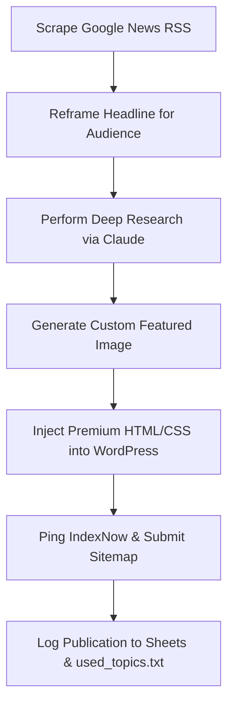

# 🤖 Autonomous WordPress AI Blogger (AI Blog Automation Agent)

[](https://github.com/navigotechsolutions-labs/wordpress-blog-automation/stargazers)
[](LICENSE)
[](https://www.python.org/)
[](https://anthropic.com)

An autonomous, self-hosted **AI Blog Automation Agent** that handles the complete content creation pipeline: trending topic discovery, deep web research, structured article drafting, custom graphic generation, premium design injection, and automatic publishing to WordPress with instant indexing.

Perfect for marketers, site owners, and agencies looking to automate high-quality, SEO-optimized content creation at scale.

---

## 🌟 Core Features

* 📰 **Automated Topic Discovery**: Pulls breaking news and trending headlines from Google News RSS feeds and reframes them for small business and marketing audiences.
* ✍️ **Claude 3.5 Sonnet Writing Engine**: Generates highly engaging, long-form (1,200+ words) articles styled with custom HTML, responsive grid layouts, and CSS variables.
* 🎨 **AI Graphic Generation**: Creates custom blog header graphics using Gemini Nano, with a smart fallback to high-quality Pexels stock photos if API limits are reached.
* 🔌 **Direct WordPress Publishing**: Injects customized Gutenberg/Elementor blocks, styles, tags, and categories directly using the WordPress REST API.
* ⚡ **Instant Search Engine Indexing**: Automatically pings Bing, Yandex, and Google via **IndexNow** and XML sitemap submissions for rapid crawling.
* 📅 **VPS-Ready Automation**: Lightweight, shell-scripted configuration optimized for running solely on virtual private servers (VPS) via `crontab`.

---

## 🔄 How the Automation Pipeline Works



---

## 🛠️ VPS Hosting Setup

Learn how to configure this agent to run autonomously on a virtual private server (e.g., Hostinger VPS).

### Step 1: Clone & Setup
```bash
git clone https://github.com/navigotechsolutions-labs/wordpress-blog-automation.git
cd wordpress-blog-automation
chmod +x setup_vps.sh run_vps_agent.sh
./setup_vps.sh
```

### Step 2: Configure Environment Variables
Open the generated `.env` file on your VPS and paste your API keys:
```bash
nano .env
```
Fill in the following fields:
* `DEEPSEEK_API_KEY`
* `ANTHROPIC_API_KEY`
* `WP_SITE_URL` (e.g., `https://yourdomain.com/blog`)
* `WP_USERNAME`
* `WP_APP_PASSWORD` (Your WordPress Application Password)
* `GOOGLE_SHEET_URL`
* `PEXELS_API_KEY`
* `GEMINI_API_KEY`

### Step 3: Run the Agent
The setup script automatically adds schedules to your VPS crontab (e.g., publishing daily at **6:30 AM** and **12:30 PM**). To run manual updates:
```bash
# Run the agent immediately
./run_vps_agent.sh
```

---

## 📄 File Directory

* `main.py`: Main entry point comprising topic discovery, generation, and posting logic.
* `keywords.txt`: Local keyword fallback queue if headlines are unavailable.
* `used_topics.txt`: Database log of already published headlines.
* `setup_vps.sh`: Script automating virtual environment and cron configuration on the server.
* `run_vps_agent.sh`: Wrapper script that pulls changes, executes, and pushes history back to GitHub.

---

## 📄 License

Distributed under the **MIT License**. See [LICENSE](LICENSE) for details.
